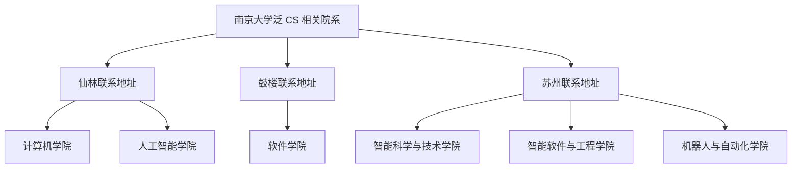

# 南京大学泛CS专业概览

南京大学在计算机科学及相关领域设有多个学院和专业方向。“学 CS”并不局限于计算机科学与技术，还涉及软件工程、人工智能、智能科学与技术、智能软件、机器人与自动化等方向。了解各院系的定位和培养差异，有助于核对适用于自己的学习与分流路径。

---

## 🏫 南大泛 CS 院系与官网联系地址

按 2026 年公开院系列表和培养方案，本指南收录计算机学院、软件学院、人工智能学院、智能科学与技术学院、智能软件与工程学院、机器人与自动化学院。下图按各学院官网当前列出的主要联系地址归类，只用于定位院系，不表示每门课、宿舍或某届学生始终位于该校区。实际教学与住宿安排以本人通知为准。

### 1. 计算机学院 / 计算机科学与技术方向 (CS)
*   **定位**：重视计算机科学基础、系统能力和算法训练。
*   **特色**：依托计算机软件新技术全国重点实验室等平台，在系统软件、程序语言、人工智能、软件工程等方向开展教学与科研。具体课程设置以所在年级培养方案为准。
*   **代表方向**：系统软件、算法理论、计算机网络、分布式计算等。

### 2. 软件学院 (SE)
*   **定位**：注重工程实践、大型软件开发与系统工程方法。
*   **特色**：国家示范性软件学院，课程设计包含团队协作与大型项目开发训练，例如《软件工程与计算》系列课程。
*   **代表方向**：软件工程、系统软件、大数据与云计算、软件分析与测试。

### 3. 人工智能学院 (AI)
*   **定位**：围绕人工智能基础理论、方法和应用开展人才培养。
*   **特色**：学院教师和 LAMDA 等研究团队在机器学习、数据挖掘等方向开展教学科研；本科课程通常包含较多数学、算法和编程训练。
*   **代表方向**：机器学习、模式识别、自然语言处理、计算机视觉。

### 4. 智能科学与技术学院 (IST) —— 苏州校区
*   **定位**：位于苏州校区，围绕智能科学与技术及相关交叉方向开展教学科研。
*   **特色**：关注智能系统、机器人、工业智能等方向；专业设置和培养要求以苏州校区及学院当年发布的信息为准。

### 5. 智能软件与工程学院 (ISE) —— 苏州校区
*   **定位**：南京大学苏州校区独立设置的学院，不是软件学院的苏州分支。
*   **特色**：围绕智能化软件、软件工程及相关交叉方向开展人才培养；招生专业和培养方案以学院当年通知为准。

### 6. 机器人与自动化学院 (RA) —— 苏州校区
*   **定位**：南京大学于 2025 年成立的学院，当前官网联系地址为苏州市太湖大道 1520 号。
*   **特色**：围绕机器人、自动化、智能控制和相关交叉方向开展教学科研。南京大学 2025 年招生信息使用“自动化（机器人方向）”这一表述；后续专业名称和培养要求应以本人招生文件、培养方案和教务系统为准。

---

## 📊 各专业对比一览

| 专业名称 | 所在学院/官网联系校区 | 招生与分流方式 | 公开培养侧重 |
| :--- | :--- | :--- | :--- |
| **计算机科学与技术** | 计算机学院 / 仙林 | 以当年招生章程、分流和准入通知为准 | 计算机系统、算法与计算理论等；具体课程看本人培养方案 |
| **软件工程** | 软件学院 / 鼓楼 | 以当年招生章程和专业准入通知为准 | 软件工程方法与项目实践；具体课程看本人培养方案 |
| **人工智能** | 人工智能学院 / 仙林 | 以当年招生章程和专业准入通知为准 | 数学、计算机与人工智能专业课程；具体层次看本人培养方案 |
| **智能科学与技术** | 智能科学与技术学院 / 苏州 | 以当年招生章程和苏州校区培养方案为准 | 智能系统及交叉方向；具体课程看本人培养方案 |
| **软件工程（智能化软件）** | 智能软件与工程学院 / 苏州 | 以当年招生章程和苏州校区培养方案为准 | 软件工程与智能化软件；专业名称和方向以当届招生文件为准 |
| **自动化（2025 年招生信息称“机器人方向”）** | 机器人与自动化学院 / 苏州 | 以当年招生章程、分流和准入通知为准 | 机器人、自动化与智能控制；专业名称以本人系统记录为准 |

---

## 💡 教学与研究特点

*   **重视计算机系统能力培养**：系统课程组推出了 Project-N、PA、OSLab 等实验项目，强调用代码理解系统。
*   **AI 教学科研平台**：LAMDA（机器学习与数据挖掘）等团队覆盖机器学习、数据挖掘等方向。具体本科课程和先修要求以培养方案为准。
*   **工程开发训练**：软件学院的培养方案包含软件工程方法和团队项目训练，课程工作量与考核方式以当期课程说明为准。

---

## 🔗 各院系官方网站

*   [南京大学计算机学院](https://cs.nju.edu.cn)
*   [南京大学软件学院](https://software.nju.edu.cn)
*   [南京大学人工智能学院](https://ai.nju.edu.cn)
*   [南京大学智能科学与技术学院介绍](https://njusz.nju.edu.cn/33/0c/c52363a602892/page.htm)
*   [南京大学智能软件与工程学院](https://ise.nju.edu.cn)
*   [南京大学机器人与自动化学院](https://ra.nju.edu.cn)
*   [南京大学本科生院（选课与转专业官方通知）](https://jw.nju.edu.cn)

!!! info "时效性提示"
    各院系招生计划、校区安排和培养方案可能调整。请以南京大学本科生院、招生办公室及各院系官网发布的适用于本人年级的文件为准。
