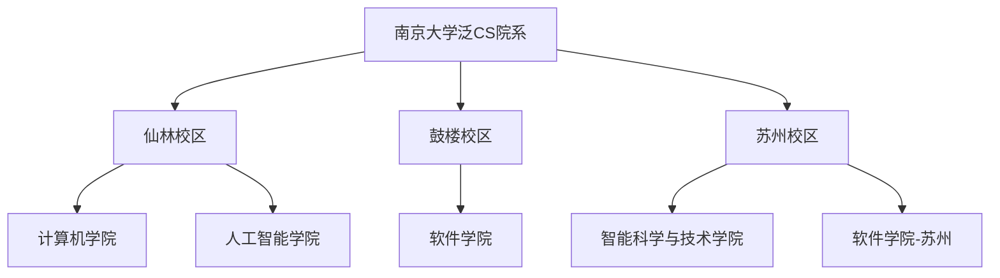

# 南京大学泛CS专业概览

南京大学在计算机科学及相关领域拥有较完整的学科体系。在南大，“学 CS”并不局限于计算机科学与技术一个专业，还包括软件工程、人工智能、智能科学与技术等方向。了解各院系的定位和培养差异，能够帮助你更好地规划未来的学习与分流方向。

---

## 🏫 南大泛CS院系结构

目前，南京大学与泛CS直接相关的院系主要包括计算机学院、软件学院、人工智能学院、智能科学与技术学院等。不同年级、专业和校区安排可能随培养方案调整，请以当年招生章程和培养方案为准。

### 1. 计算机学院 / 计算机科学与技术方向 (CS)
*   **定位**：传统王牌，理论与系统并重。
*   **特色**：依托计算机软件新技术国家重点实验室等平台，在系统软件、程序语言、人工智能、软件工程等方向积累深厚。计算机系统基础、操作系统等课程在自学社区中也有较高知名度。
*   **代表方向**：系统软件、算法理论、计算机网络、分布式计算等。

### 2. 软件学院 (SE)
*   **定位**：注重工程实践、大型软件开发与系统工程方法。
*   **特色**：国家示范性软件学院，课程设计非常强调团队协作与大型项目开发（如著名的《软件工程与计算》系列课程）。
*   **代表方向**：软件工程、系统软件、大数据与云计算、软件分析与测试。

### 3. 人工智能学院 (AI)
*   **定位**：南京大学人工智能学院是国内较早成立的人工智能学院之一，理论和科研训练强度较高。
*   **特色**：依托 **LAMDA 研究所**，课程体系极其硬核，数学要求高，涵盖机器学习、深度学习、数据挖掘等AI前沿方向。
*   **代表方向**：机器学习、模式识别、自然语言处理、计算机视觉。

### 4. 智能科学与技术学院 (IST) —— 苏州校区
*   **定位**：苏州校区的新兴力量，注重产学研结合与智能化应用。
*   **特色**：与苏州当地高新技术产业紧密结合，聚焦于智能系统、机器人、工业智能等交叉学科。

---

## 📊 各专业对比一览

| 专业名称 | 所在学院/校区 | 招生与分流方式 | 核心课程特色 | 典型毕业去向 |
| :--- | :--- | :--- | :--- | :--- |
| **计算机科学与技术** | 计算机学院 | 以当年招生章程、分流和准入通知为准 | 强调系统能力与算法理论 (ICS, OS, 编译等) | 国内外深造、研发工程、算法/系统方向 |
| **软件工程** | 软件学院 | 以当年招生章程和专业准入通知为准 | 强调团队协作项目、软件体系结构与工程实践 | 软件研发、架构、测试、项目管理、深造 |
| **人工智能** | 人工智能学院 | 以当年招生章程和专业准入通知为准 | 数学基础要求高，机器学习与算法理论导向 | 算法研发、科研深造、AI 工程方向 |
| **智能科学与技术** | 智能科学与技术学院（苏州） | 以当年招生章程和苏州校区培养方案为准 | 智能系统、软硬件协同、模式识别等 | 智能系统研发、工业智能、深造 |

---

## 💡 南大CS的特色与优势

*   **重视计算机系统能力培养**：系统课程组推出了 Project-N、PA、OSLab 等实验项目，强调用代码理解系统。
*   **较强的 AI 研究平台**：LAMDA（机器学习与数据挖掘）研究所等团队在机器学习、数据挖掘等方向影响力较强。人工智能学院本科课程对数学和算法基础要求较高。
*   **扎实的工程开发训练**：软件学院以一系列大型团队项目作业著称，培养出的学生具有极强的工程协作能力，是工业界非常青睐的开发主力。

---

## 🔗 各院系官方网站

*   [南京大学计算机学院](https://cs.nju.edu.cn)
*   [南京大学软件学院](https://software.nju.edu.cn)
*   [南京大学人工智能学院](https://ai.nju.edu.cn)
*   [南京大学智能科学与技术学院](https://ist.nju.edu.cn)
*   [南京大学本科生院（选课与转专业官方通知）](https://jw.nju.edu.cn)

!!! info "时效性提示"
    随着南京大学“双活双城”及苏州校区建设的推进，各院系招生计划和培养方案可能会有动态调整。请务必随时关注学校教务处及各院系官网发布的最新培养方案。
