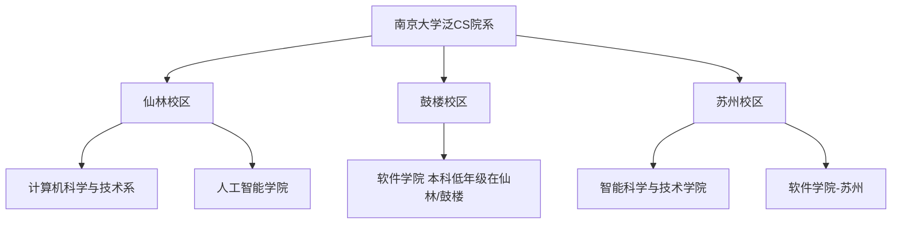

# 南京大学泛CS专业概览

南京大学在计算机科学及相关领域拥有极其雄厚的师资力量与完整的学科体系。在南大，“学CS”并不局限于计算机科学与技术系，还包括软件学院、人工智能学院、智能科学与技术学院等。了解各院系的院系定位和特色，能够帮助你更好地规划未来的学习与分流方向。

---

## 🏫 南大泛CS院系结构

目前，南京大学与泛CS直接相关的院系主要分布在**仙林校区**、**鼓楼校区**以及**苏州校区**：

### 1. 计算机科学与技术系 (CS)
*   **定位**：传统王牌，理论与系统并重。
*   **特色**：拥有著名的**软件新技术国家重点实验室**，并在计算机系统结构、操作系统、编译原理等方面有深厚底蕴。蒋炎岩老师的《操作系统》和《计算机系统基础》等课程在全国极具影响力。
*   **代表方向**：系统软件、算法理论、计算机网络、分布式计算等。

### 2. 软件学院 (SE)
*   **定位**：注重工程实践、大型软件开发与系统工程方法。
*   **特色**：国家示范性软件学院，课程设计非常强调团队协作与大型项目开发（如著名的《软件工程与计算》系列课程）。
*   **代表方向**：软件工程、系统软件、大数据与云计算、软件分析与测试。

### 3. 人工智能学院 (AI)
*   **定位**：由周志华教授领衔创办，国内首批人工智能学院，理论学术底蕴深厚。
*   **特色**：依托 **LAMDA 研究所**，课程体系极其硬核，数学要求高，涵盖机器学习、深度学习、数据挖掘等AI前沿方向。
*   **代表方向**：机器学习、模式识别、自然语言处理、计算机视觉。

### 4. 智能科学与技术学院 (IST) —— 苏州校区
*   **定位**：苏州校区的新兴力量，注重产学研结合与智能化应用。
*   **特色**：与苏州当地高新技术产业紧密结合，聚焦于智能系统、机器人、工业智能等交叉学科。

---

## 📊 各专业对比一览

| 专业名称 | 所在学院/校区 | 招生与分流方式 | 核心课程特色 | 典型毕业去向 |
| :--- | :--- | :--- | :--- | :--- |
| **计算机科学与技术** | 计算机科学与技术系 (仙林) | 理科试验班（数理科学类）分流 / 拔尖班 | 强调系统能力与算法理论 (ICS, OS, 编译) | 国内外深造、大厂研发、算法工程师 |
| **软件工程** | 软件学院 (鼓楼/仙林) | 软件工程单列招生 / 转专业 | 强调团队协作项目、软件体系结构与工程实践 | 软件架构师、全栈工程师、产品/项目经理 |
| **人工智能** | 人工智能学院 (仙林) | 人工智能单列招生 / 理科试验班分流 | 数学基础极其硬核、机器学习与算法理论导向 | 算法研究员、高校深造、大厂算法岗 |
| **智能科学与技术** | 智能科学与技术学院 (苏州) | 苏州校区单列招生 | 智能控制、软硬件协同、模式识别 | 智能硬件开发、工业智能、深造 |

---

## 💡 南大CS的特色与优势

*   **极强的计算机系统能力培养**：以蒋炎岩（jyy）老师等领衔的系统课程组，推出了一系列硬核系统实验项目（如 [Project-N](../courses/cs-core/ics.md)），强调“用代码说话”，培养出具有极强动手能力的系统级程序员。
*   **顶尖的 AI 研究平台**：周志华老师领导的 LAMDA（机器学习与数据挖掘）研究所是国际知名的AI研究机构。人工智能学院的本科课程能够让你在本科阶段就直接接触到最前沿的机器学习理论。
*   **扎实的工程开发训练**：软件学院以一系列大型团队项目作业著称，培养出的学生具有极强的工程协作能力，是工业界非常青睐的开发主力。

---

## 🔗 各院系官方网站

*   [南京大学计算机科学与技术系](https://cs.nju.edu.cn)
*   [南京大学软件学院](https://se.nju.edu.cn)
*   [南京大学人工智能学院](https://ai.nju.edu.cn)
*   [南京大学本科生院（选课与转专业官方通知）](https://jw.nju.edu.cn)

!!! info "时效性提示"
    随着南京大学“双活双城”及苏州校区建设的推进，各院系招生计划和培养方案可能会有动态调整。请务必随时关注学校教务处及各院系官网发布的最新培养方案。
